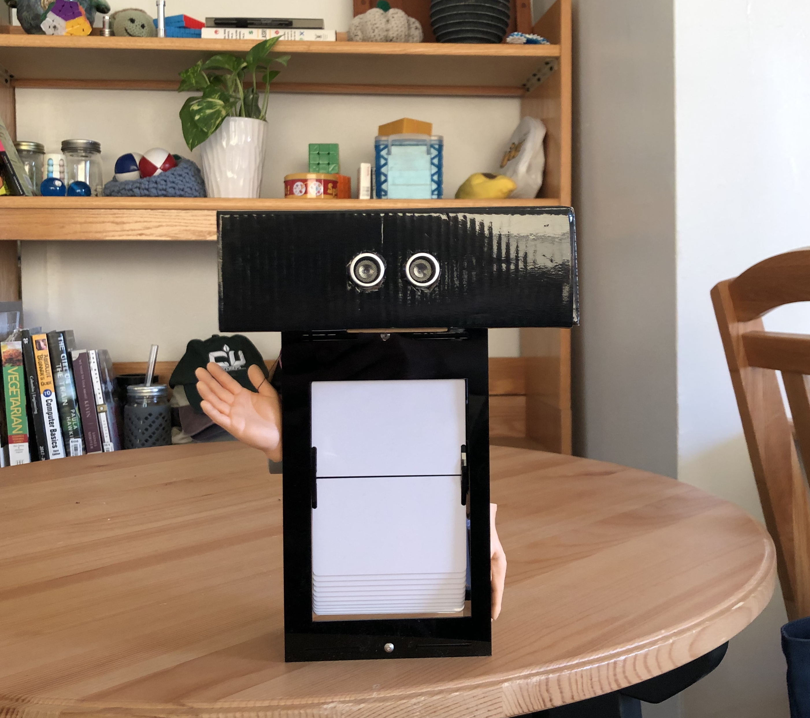

# COMS 3930: Creative Embedded Systems
## Final Project – Ricardo   Spencer Bruce 

### Included Files

I have uploaded the following to the GitHub repo:
- this README 
- a splitflap.ino program to be run on an ~~ESP32~~ Arduino Uno microcontroller. This is what controls the stepper motor movements + reads input from the ultrasonic sensor in Ricardo's big brain.
- some pictures 

A video of Ricardo's reluctant, big-headed performance can be seen [here](https://youtu.be/0wtrhmuRQ34). 

### Creative Vision
I love the sound of old-timey split flap displays. They're fun and ASMR-y and I wanted to make one for myself. I found [a person on GitHub](https://github.com/scottbez1/splitflap) that documented a bit of their process in making a split flap display of their own, and their documentation and instructions were immensely helpful in designing my own iteration.

### Design Process + the Mistakes that Were Made
To start off, I referenced Scottbez1's designs and cherry-picked what was within my budget, time allowance, and feasibility given the hardware at my disposal. For example, I was not willing to get custom-printed PCBs for one (1) split flap display. So, instead, I made do with the stepper motor that came included in our class kit. More on that later. 

Many of Scottbez1's suggestions re: cutting the split-flap cards and assembling one module were super helpful, and I scrounged around the materials within my disposal in order to create the most sturdy frame I could. My split-flap display contains 60 cards instead of 40 and one "digit" is the size of two ID cards, not one. 

After a few test laser prints in cardboard and counting of screws/nuts, I got to assembling! I used 1/8th inch opaque black cast acrylic for the frame + inner mechanism of Ricardo. If I were to repeat this process, I would use a sturdier (read: less cheap) acrylic, as mine is a bit flimsy and sometimes the cards all fall out. Not a fun time! 

The original plan was to have Ricardo cycle through an animation that I hand-drew myself, but the cards were not receptive to pens nor markers and I could not feasiblly vinyl cut all 60 frames by hand. For future iterations! :) 

Once Ricardo's main body was built, I attempted to run a test script that rotated the stepper motor. Slight problem. I could feel the motor _trying_ to turn, but it just didn't have enough torque. However, I would soon have an even bigger problem on my hands! My ESP32 DIED! RIP 2021-2021, Amazon kit ESP32 :( 

Very luckily I had a spare Arduino to use, and luckily I didn't need to use too many pins nor memory to get Ricardo to run. Try as I did to source a 12V stepper motor, though ... I had to do what any respectable computer scientist would do. I gave the 5V stepper motor 12V of power to get some extra oomf and pretended it was not an issue. 

Did the stepper get hot? Sometimes. Did I run it for long nough to find out what would happen? No. Will it eventually burn out the motor? Most definitely. Is it good enough for Ricardo? You betcha. 

My final enclosure did end up being a bit larger than anticipated to make up for the larger power supply and the Arduino. That's fine. Ricardo just has a comically large skull! 

Once it was time to use the ultrasonic sensor, I ran into some code troubles. The stepper motor would fully stall the execution of my main loop, which, when incorrectly formatted, would cause Ricardo to become unresponsive after the first interaction. This gave birth to the idea of a shy robot, one that only does its job when you arern't looking :) I think it's cute! The ultrasonic sensor was new to me, but wasn't too hard to use after following a few tutorials. (It was cool to hear the frequencies in my phone microphone when I was filming, too.) So once I figured out what was causing the stepper motor and ultrasonic sensor to be incompatible, I set up my code to do the following: 

- spin the flaps when nobody is looking
- if someone is looking, STOP!!!
    -  unless they've been here for a while. In that case, Ricardo can get used to the company.

All that I had left to do was shove everything in a box, get my code working correctly, not burn down all of the Design Center and the Milstein Center for Teaching and Learning, and slap on some funny lil rubber hands to accompany the ultrasonic sensor eyes. 

### Dependencies
I used the following items to create this project: 
- 1 x ~~ESP-32 microcontroller~~ Arduino Uno
- 1 x custom laser-cut frame (modified from [this user](https://github.com/scottbez1/splitflap)'s designs)
- 1 x 5V stepper motor + controller (12V preferred, I used the one from my kit)
- 60 x [PVC ID cards](https://www.amazon.com/dp/B06XX721LP?psc=1&ref=ppx_yo2_dt_b_product_details)
- 1 x [ID card hole punch](https://www.amazon.com/Punch-Badge-Plier-Stainless-Steel/dp/B01DLSOZSU/ref=sr_1_6?dchild=1&keywords=id+hole+punch&qid=1619235209&sr=8-6) (I got mine for free from a lovely neighbor on my local Buy Nothing group!)
- 1 x ultrasonic sensor (kit)
- 1 x 12V battery pack
- 1 x voltage converter 
- 2 x hyper-realistic miniature hands (for fun)
- some wires + cables
- a cardboard box
- a craft knife
- imagination 